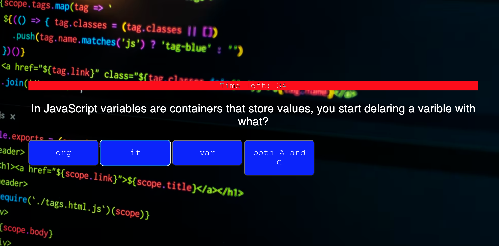

Bryon's Web API's Code Quiz

## User Story

Here is my timed quiz on JavaScript fundamentals that stores high scores so that the USER can gauge progress with their peers

## Acceptance Criteria

# GIVEN I am taking a code quiz

# WHEN I click the start button

# THEN a timer starts and I am presented with a question

# WHEN I answer a question

# THEN I am presented with another question

# WHEN I answer a question incorrectly

# THEN time is subtracted from the clock

# WHEN all questions are answered or the timer reaches 0

# THEN the game is over

# WHEN the game is over

# THEN I can save my initials and my score

# This is a link to my deployed/GitHub pages application

https://bryonbsmb1.github.io/bballCodeQuiz/

